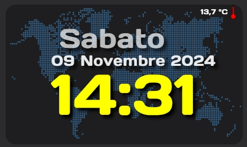
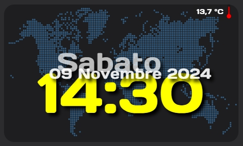
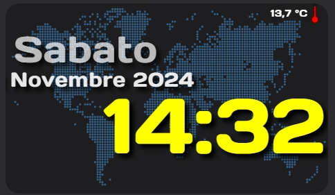

<h2><strong>⌚ Big Clock card for home assistant</strong></h2>

Volevo condividere una card che ho creato con l'aiuto delle varie community per visualizzare data, ora e anche un piccolo termometro.

Istruzioni:

1. nella cartella packeges copiate il file sensor_time_e_date.yaml
2. nel file sensor.yaml, copiate il contenuto del file sensor.txt modificato in base al nome del vostro paese e il sensore meteo che utilizzate
3. nella cartella www dovete andare ad incollare le immagini per gli sfondi che vi sceglierete voi nel mio caso sono qua: www\orologio\
4. nella card, sicuramente cambiate   - entity: sensor.temp_motta con quello che avete inserito nel file sensor, se volete invece modificare dimensioni, e spostamenti delle varie scritte (date, ora ecc.) modificate queste righe: font-size: 800%, left: 50%, top: 64% per ogni entità.
5. il parametro font-family: dovete andare a personalizzarlo con un font a vostra scelta, io ho scelto questo: Days One, per abilitarlo seguire questa guida: https://www.youtube.com/watch?v=p6HAxsEGe9M
6. in HA create una card manuale e incollate il contenuto del file: big_clock_card.txt

Risultato finale:

Enjoy!

----------------------------------------

Would you like to give me a hand? The content of this page is completely free of charge and the purpose is certainly not to make money. If you would like to lend me a hand to help with expenses and lost time, you have the following ways:

Make your Amazon purchases from this link:

Join our Telegram channel dedicated to Home Assistant news:

Join our Telegram channel dedicated to home automation products, there are lots of offers:

